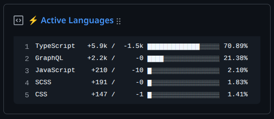
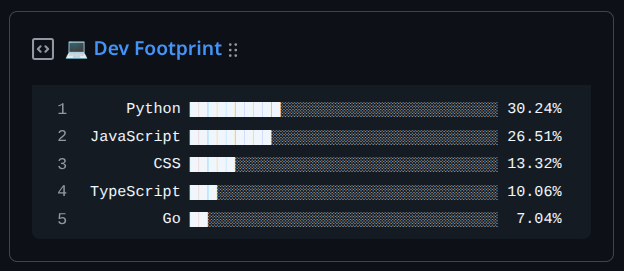

<div align="center">
    
    <h1>pinned-gists</h1>
    <p>Automatically generate GitHub stats and pin them as dynamic gists.</p>
    <p>
        <a href="https://www.typescriptlang.org/"></img></a>
        <a href="https://vitest.dev/"></img></a>
        <a href="https://https://pnpm.io/"></img></a>
        <a href="https://biomejs.dev/"></img></a>
    </p>
    <p>
        <a href="https://github.com/seyLu/pinned-gists/issues/new">Report Bug</a>
        ·
        <a href="https://github.com/seyLu/pinned-gists/issues/new">Request Feature</a>
        ·
        <a href="https://github.com/seyLu/pinned-gists/discussions">Ask Question</a>
    </p>
</div>

<br>

#### [active-languages](https://github.com/seyLu/pinned-gists/blob/main/packages/active-languages/README.md)


#### [total-languages](https://github.com/seyLu/pinned-gists/blob/main/packages/total-languages/README.md)


<br>

<div id="fine-grained-token"></div>

### GitHub Fine-Grained Token Permissions

#### Public repositories only

Use these permissions if you only want to generate stats from public repositories:

| Category     | Permission | Access       | Purpose                              |
| ------------ | ---------- | ------------ | ------------------------------------ |
| Repositories | Metadata   | Read-only    | Read public repository language data |
| Account      | Gists      | Read & Write | Update the pinned gists              |

#### Including private repositories

Add these if you also want private repository activity included:

| Category     | Permission | Access    | Purpose                                             |
| ------------ | ---------- | --------- | --------------------------------------------------- |
| Repositories | Contents   | Read-only | Access private repo file data for language analysis |
| Account      | Events     | Read-only | Access private contribution activity                |

<br>

### Developing locally

#### 1. Install dependencies

```bash
pnpm i
```

#### 2. Create .env file

```bash
cp .env.example .env
```

Edit `.env` with your values

```env
GH_USERNAME=xxx
GH_TOKEN=xxx

# active-languages
AL_GIST_ID=xxx
AL_GIST_DESCRIPTION=⚡ Active Languages

# total-languages
TL_GIST_ID=xxx
TL_GIST_DESCRIPTION=💻 Dev Footprint

EXCLUDE_LANG=Text,Markdown,HTML,YAML,JSON
EXCLUDE_REPO=xxx
```


#### 3. Run a package in dev mode

```bash
pnpm al:dev
# will run dev script of 'active-languages' package
```

<br>

### GitHub Action Setup

#### Required Repository Secret:

| Variable       | Description                                                                                               |
| -------------- | --------------------------------------------------------------------------------------------------------- |
| GH_TOKEN       | GitHub access token with [fine-grained token permissions](#fine-grained-token)                            |

#### Required Repository Variables:

| Variable       | Description                                                                                               |
| -------------- | --------------------------------------------------------------------------------------------------------- |
| AL_GIST_ID     | Gist ID for active-languages                                                                              |
| TL_GIST_ID     | Gist ID for total-languages                                                                               |

*`https://gist.github.com/<username>/<gist-id>`*

#### Optional Repository Variables:

| Variable       | Description                                                                                               |
| ------------   | --------------------------------------------------------------------------------------------------------- |
| EXCLUDE_LANG   | Comma-separated list of languages to exclude. Example: `Jupyter Notebook,CSS,TeX,PHP`                     |
| EXCLUDE_REPO   | Comma-separated list of repositories to exclude. Example: `repo1,repo2`                                   |
| AL_DESCRIPTION | Custom gist description for active-languages                                                              |
| TL_DESCRIPTION | Custom gist description for total-languages                                                               |

*See [languages.yml](https://raw.githubusercontent.com/github/linguist/main/lib/linguist/languages.yml) for supported languages*

### Create a gist
1. Visit https://gist.github.com
2. Create a new public gist
3. Add a filename (e.g., active-languages.txt)
4. Copy the gist ID from the URL (<gist-id>)

<br>

### Pin to profile
1. Follow GitHub’s instructions: [Pinning items to your profile](https://docs.github.com/en/account-and-profile/customizing-your-profile/pinning-items-to-your-profile)
